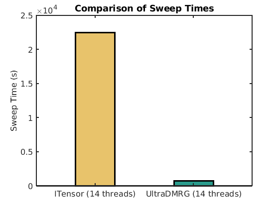

# UltraDMRG: A Powerful 1D Tensor Network Library for Simulating Strongly Correlated Electron Systems

[]()

QuantumLiquids/UltraDMRG is a powerful and efficient library for performing large-scale,
high-performance calculations using one-dimensional tensor network algorithms.
It is specifically designed to tackle the complexities of simulating untamable
two-dimensional strongly correlated electron systems.
Our goal in creating this package is to lower the barriers
associated with simulating strongly correlated electron systems,
offering a user-friendly and accessible solution for researchers in this field.

## Features

UltraDMRG offers the following key features:

- [x] MPI parallelization of Density Matrix Renormalization Group
- [x] MPI parallelization of MPS-based time-dependent variational principle algorithm
- [x] Finite-temperature calculation

## To-Do List

- [ ] infinite DMRG
- [ ] DMRG low-energy excitation states

## Performance Benchmark

As a demonstration of the performance of UltraDMRG,
we conducted a benchmark comparing the performance of UltraDMRG with ITensor(C++).
Specifically, we on focused on comparing the DMRG sweep time using both packages.
The test model is the $4 \times 16$ Hubbard cylinder at a doping level of 1/8,
and we maintain a kept state dimension of $D=2000$ with incorporating $U(1)\times U(1)$ symmetry.



Note that ITensor utilizes the Davidson method for diagonalizing the Hamiltonian,
whereas UltraDMRG employs the Lanczos method.
This difference in methodology makes a performance comparison not straightforward.
To ensure a fair evaluation, we established consistent parameters for both packages
in the following way.
The truncation error cut-off was set at $10^{-8}$,
and the diagonalized Hamiltonian accuracy at $10^{-9}$.
We also set the iteration times for both the Davidson and Lanczos methods to 100,
effectively approaching infinity.
We specifically selected sweep times exclusively from near-converged sweeps.
We also close the MPI acceleration in UltraDMRG.
We hope above setting can ensure an unbiased comparison.

The codes used in the benchmark can be found in the directory `./benchmark`.
The results of the performance benchmark,
showcasing the sweep times, are presented in the accompanying figure.

## Dependence

Please note that the project requires the following dependencies
to be installed in order to build and run successfully:

- C++17 Compiler
- CMake (version 3.12 or higher)
- Intel MKL or OpenBlas
- MPI
- Boost::serialization, Boost::mpi (version 1.74 or higher)
- [QuantumLiquids/TensorToolkit](https://github.com/QuantumLiquids/TensorToolkit)
- GoogleTest (if testing is required)

## Install

Clone the repository into a desired directory and change into that location:

```
git clone https://github.com/QuantumLiquids/UltraDMRG.git
cd UltraDMRG
```

Using CMake:

```
mkdir build && cd build
cmake .. 
make -j4 && make install

```

You may want to specify `CMAKE_CXX_COMPILER` as your favorite C++ compiler,
and `CMAKE_INSTALL_PREFIX` as your install directory when you're calling `cmake`

## Author

Hao-Xin Wang

For any inquiries or questions regarding the project,
you can reach out to Hao-Xin via email at wanghaoxin1996@gmail.com.

## Acknowledgments

UltraDMRG is built upon the foundation laid by the [GraceQ/MPS2](https://mps2.gracequantum.org) project.
While initially inspired by GraceQ/mps2,
UltraDMRG expands upon its capabilities by adding additional 1D tensor-network algorithms, dramatically improving
performance, and most
importantly, introducing support for MPI parallelization.
We would like to express our gratitude to the following individuals for their contributions and guidance:

- Rong-Yang Sun, the author of [GraceQ/mps2](https://mps2.gracequantum.org), for creating the initial framework that
  served as the basis for UltraDMRG.
- Yi-Fan Jiang, providing me with extensive help and guidance in writing parallel DMRG
- Hong Yao, my PhD advisor. His encouragement and continuous support
  of computational resources played crucial roles in the implementation of parallel DMRG.
- Zhen-Cheng Gu, my postdoc advisor, one of the pioneers in the field of tensor network.

Their expertise and support have been invaluable in the development of UltraDMRG.

## License

UltraDMRG is released under the LGPL3 License. Please see the LICENSE file for more details.
